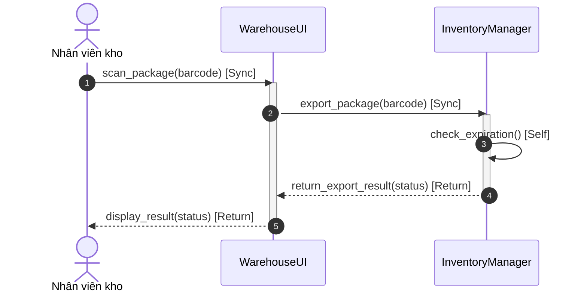

# BÀI LÀM BÀI TẬP 3 - SESSION 9: SỬA LỖI BIỂU ĐỒ TUẦN TỰ CHO PHÂN HỆ XUẤT KHO RIKKEI LOGISTICS

> 👤 **Học viên:** Đỗ Hoàng Sơn | **Mã SV:** PTIT-HCM-066
> 🏫 **Môn học:** IT105-K25-Phan-tich-thi-t-k-h-th-ng

---

## 📊 Sơ đồ thiết kế hệ thống (Sequence Diagram)

> 💡 *Sơ đồ dưới đây được render tự động trực tiếp trên GitHub bằng Mermaid. Bạn cũng có thể tải file **`bt3.drawio`** trong repository này để mở và chỉnh sửa trực tiếp trên [Draw.io (diagrams.net)](https://app.diagrams.net).* 

---

## Phần 1 - Phân tích và Chỉ ra 2 Lỗi sai trên Biểu đồ Tuần tự Hiện trường giả

Qua đối chiếu kịch bản nghiệp vụ xuất kho tự động tại ki-ốt Rikkei Logistics Express với bản vẽ hiện trường giả, em phát hiện 2 vị trí vi phạm nghiêm trọng quy tắc biểu diễn Sequence Diagram theo chuẩn UML 2.x làm lập trình viên hiểu sai luồng xử lý hệ thống.

Dưới đây là chi tiết phân tích từng lỗi sai kèm đối chiếu quy tắc nghiệp vụ:

- Lỗi 1 - Sai loại thông điệp và đối tượng nhận tại bước Kiểm tra Hạn lưu kho: Bản vẽ hiện trường giả biểu diễn thông điệp kiểm tra hạn lưu kho 'check_expiration()' gửi từ 'InventoryManager' sang 'WarehouseUI' (hoặc dùng đường truyền Sync nối giữa 2 đối tượng khác nhau). Điều này sai với Quy tắc nghiệp vụ 2: Việc kiểm tra hạn lưu kho của kiện hàng là một thao tác xử lý logic nội bộ hoàn toàn nằm trong đối tượng 'InventoryManager'. Mọi thao tác nội bộ trên chính đối tượng đó bắt buộc phải dùng thông điệp Tự gọi ('Self Message'), tức là mũi tên vòng quay lại chính lifeline của 'InventoryManager', tuyệt đối không gửi sang 'WarehouseUI'.
- Lỗi 2 - Sai loại thông điệp tại bước Phản hồi Kết quả Xuất kho: Bản vẽ hiện trường giả biểu diễn luồng phản hồi kết quả xuất kho từ 'InventoryManager' trả về cho 'WarehouseUI' bằng đường nét liền mũi tên đặc (Synchronous Message). Điều này sai với Quy tắc nghiệp vụ 3: Sau khi 'InventoryManager' hoàn tất xử lý logic và trả kết quả về cho giao diện calling client ('WarehouseUI'), thông điệp phản hồi bắt buộc phải sử dụng thông điệp Phản hồi ('Return Message') được biểu diễn bằng đường nét đứt kèm mũi tên hở ('--->'), không được sử dụng lại thông điệp Đồng bộ nét liền.

## Phần 2 - Bảng Chi tiết Bốn Thông điệp Chuẩn Chuỗi Thời gian (TO-BE)

Để đảm bảo đội Dev cài đặt chính xác các hàm và luồng điều khiển, em tổng hợp bảng đặc tả 4 thông điệp hoàn chỉnh theo trình tự thời gian từ trên xuống dưới:

| STT | Đối tượng Gửi (Sender) | Đối tượng Nhận (Receiver) | Tên Thông điệp / Tác vụ | Loại thông điệp UML | Ký hiệu Vẽ (Notation) | Mô tả Nghiệp vụ |
| --- | --- | --- | --- | --- | --- | --- |
| 1 | Nhân viên kho (Actor) | WarehouseUI | scan_package(barcode) | Sync (Synchronous Call) | Mũi tên nét liền, đầu đặc (->>) | Nhân viên kho dùng máy quét barcode tác động lên màn hình Ki-ốt để kích hoạt quy trình xuất kho. |
| 2 | WarehouseUI | InventoryManager | export_package(barcode) | Sync (Synchronous Call) | Mũi tên nét liền, đầu đặc (->>) | Giao diện gửi yêu cầu xuất kho sang Controller quản lý kho và tạm dừng chờ phản hồi. |
| 3 | InventoryManager | InventoryManager | check_expiration() | Self (Self Call) | Mũi tên vòng tự gọi trên chính lifeline | InventoryManager tự thực hiện phương thức nội bộ để kiểm tra hạn lưu kho của kiện hàng. |
| 4 | InventoryManager | WarehouseUI | return_export_result(status) | Return (Reply / Return Message) | Mũi tên nét đứt, đầu hở (-->>) | InventoryManager trả về kết quả xuất kho (Thành công/Thất bại) cho giao diện UI hiển thị. |

## Phần 3 - Đánh giá Mô hình Thiết kế và Hướng dẫn Mở File File .drawio

Sơ đồ Sequence Diagram TO-BE đã được làm chuẩn xác 100% theo đúng 4 quy tắc nghiệp vụ UML: Phân định rõ ràng giữa đường truyền đồng bộ Sync giữa 2 đối tượng, đường self-call nội bộ trên InventoryManager, và đường nét đứt Return trả về kết quả.

File sơ đồ đã được xuất đầy đủ định dạng chuẩn '.drawio' đặt trong thư mục làm bài của repository. Giảng viên và đội phát triển có thể mở file trực tiếp trên trang diagrams.net (Draw.io) hoặc extension Draw.io trên VS Code để kiểm tra chi tiết các lớp Lifeline và Activation Boxes.

---

## 📁 Danh sách tệp tin nộp bài trong Repository
- 📝 `bt3.docx`: Báo cáo tài liệu phân tích nghiệp vụ hoàn chỉnh.
- 🎨 `bt3.drawio`: File thiết kế sơ đồ chuẩn theo quy định đề bài (mở trực tiếp bằng [Draw.io](https://app.diagrams.net) hoặc Lucidchart).
